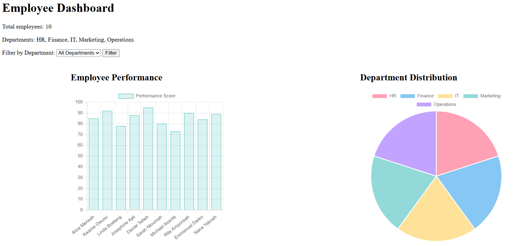

Absolutely, Charles — here’s a polished, consulting-ready `README.md` tailored for your Django Employee Performance Dashboard. It highlights your technical skills, business relevance, and academic professionalism.

---

## 📘 `README.md` for GitHub

```markdown
# Django Employee Performance Dashboard

A dynamic web dashboard built with Django and Chart.js to visualize employee performance across departments. Designed for HR analytics, academic demonstration, and consulting portfolio use.

## 🔍 Project Overview

This dashboard enables users to:
- View employee performance scores
- Filter data by department
- Visualize scores with interactive bar and pie charts
- Manage data via Django’s admin panel

Built as part of a portfolio initiative to demonstrate real-world business analytics and data visualization skills using Python and Django.

## 🚀 Features

- ✅ Admin panel for secure data entry
- ✅ Department-based filtering via dropdown
- ✅ Bar chart of performance scores (Chart.js)
- ✅ Pie chart of department distribution
- ✅ Clean, responsive HTML template
- 🔜 CSV upload and export functionality (coming soon)

## 🛠️ Technologies Used

- Python 3.13
- Django 5.2
- Chart.js (via CDN)
- HTML5 & CSS3
- Git & GitHub

## 📦 Setup Instructions

1. **Clone the repository**
   ```bash
   git clone https://github.com/cmotwore/Employee_Dashboard.git
   cd Employee_Dashboard
   ```

2. **Create and activate a virtual environment**
   ```bash
   python -m venv venv
   source venv/bin/activate  # On Windows: venv\Scripts\activate
   ```

3. **Install dependencies**
   ```bash
   pip install -r requirements.txt
   ```

4. **Run migrations**
   ```bash
   python manage.py makemigrations
   python manage.py migrate
   ```

5. **Create a superuser**
   ```bash
   python manage.py createsuperuser
   ```

6. **Start the development server**
   ```bash
   python manage.py runserver
   ```

7. **Access the dashboard**
   - Admin panel: `http://127.0.0.1:8000/admin`
   - Dashboard view: `http://127.0.0.1:8000/`

## 📊 Sample Data Format

You can manually enter data via the admin panel or upload a CSV (coming soon). Sample fields:

```csv
name,department,performance_score,date
Alice Mensah,HR,85,2025-10-01
Kwame Owusu,Finance,92,2025-10-03
```

## 📸 Screenshots

> _Add screenshots of your dashboard and charts here for visual impact._
>
> 

## 📚 Author

**Charles Motwore**  
Master’s Student in Computer Information Systems & Business Analytics  
Focused on portfolio-building, consulting-grade deliverables, and ethical data science.

---

## 💡 Future Enhancements

- CSV upload for bulk data entry
- Export charts as images or PDFs
- Deployment to Render or Heroku
- Role-based access control for HR managers

---

## 📝 License

This project is for academic and portfolio use. Feel free to fork and adapt with attribution.

```

---

Let me know if you'd like help adding screenshots or customizing the tone for your lecturer. You’re presenting this like a pro!
